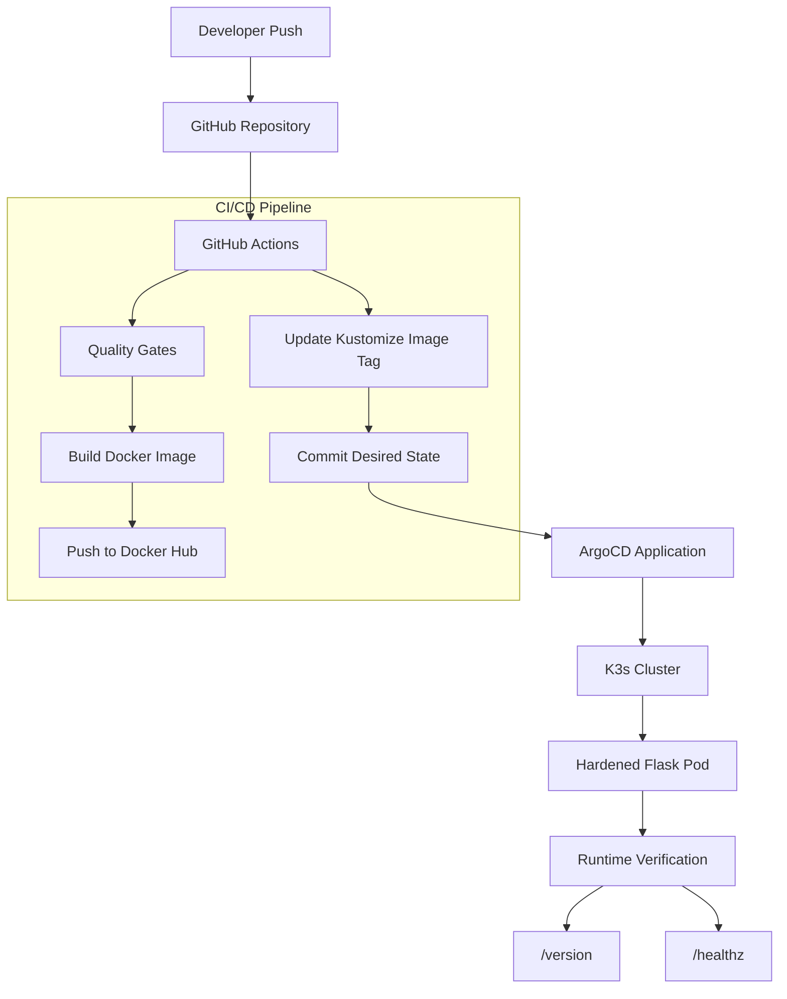
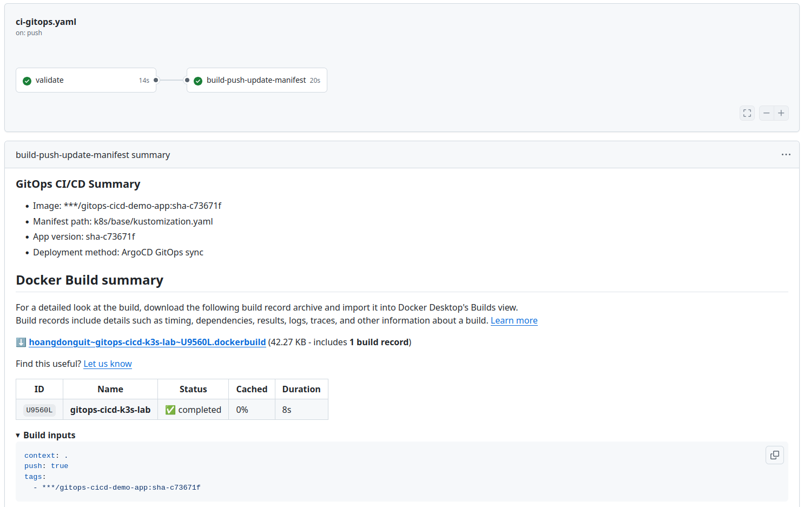
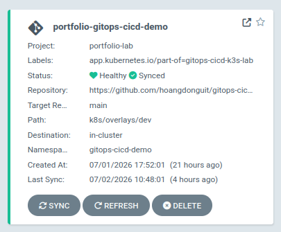
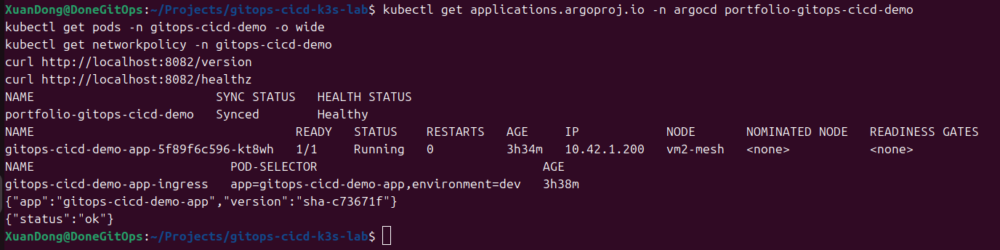
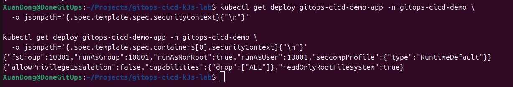

# gitops-cicd-k3s-lab

[](https://github.com/hoangdonguit/gitops-cicd-k3s-lab/actions/workflows/ci-gitops.yaml)
[](https://github.com/hoangdonguit/gitops-cicd-k3s-lab/actions/workflows/manifest-validate.yaml)

A portfolio DevOps / Cloud-Native lab demonstrating an end-to-end CI/CD and GitOps workflow using GitHub Actions, Docker Hub, Kustomize, ArgoCD, and a K3s cluster.

The project focuses on a practical deployment lifecycle: build a container image, publish it with an immutable commit SHA tag, update Kubernetes desired state in Git, let ArgoCD reconcile the cluster, verify the running version, and prove rollback through GitOps.

## Architecture Diagram



## What This Project Demonstrates

- CI/CD pipeline design with GitHub Actions.
- Docker image build and push to Docker Hub.
- Immutable image tagging using Git commit SHA.
- Kubernetes manifest management with Kustomize.
- GitOps deployment model with ArgoCD.
- Runtime deployment on K3s.
- Application health and version verification.
- GitOps rollback and roll-forward without direct manual Deployment edits.
- Clear separation between CI responsibilities and CD/GitOps responsibilities.

## Verified Capabilities

- End-to-end deployment from code change to running Kubernetes pod.
- CI quality gates with unit tests and Kustomize render validation.
- Container and Kubernetes security hardening with non-root runtime and restricted privileges.
- ArgoCD Application isolation using a dedicated AppProject and namespace.
- Rollback from `sha-be95c88` to `sha-9a1d923`.
- Roll-forward back to `sha-be95c88`.
- Runtime evidence documented under `docs/evidence/`.
- Operational runbook documented under `docs/runbook/`.

## 1. Project Goal

This project demonstrates a practical DevOps / Cloud-Native deployment flow:

```text
Developer push code
-> GitHub Actions CI
-> Build Docker image
-> Push image to Docker Hub
-> Update Kubernetes manifest image tag
-> Commit manifest change back to Git
-> ArgoCD syncs desired state to K3s
-> New application version runs in the cluster
```

## 2. Tech Stack

| Area | Tool |
|---|---|
| Demo app | Python Flask |
| Container | Docker |
| Image registry | Docker Hub |
| CI/CD | GitHub Actions |
| Manifest management | Kustomize |
| Runtime | K3s |
| GitOps controller | ArgoCD |

## 3. Repository Structure

```text
app/                 Flask application source code
k8s/base/            Base Kubernetes manifests
k8s/overlays/dev/    Dev environment Kustomize overlay
Dockerfile           Container image definition
requirements.txt     Python dependencies
```

## 4. Local Development

Run the Flask app locally:

```bash
python3 -m venv .venv
source .venv/bin/activate
pip install -r requirements.txt

APP_VERSION=local-test flask --app app.main run --host 0.0.0.0 --port 8080
```

Test:

```bash
curl http://localhost:8080/
curl http://localhost:8080/healthz
curl http://localhost:8080/version
```

## 5. Docker Build

```bash
docker build -t hoangdonguit/gitops-cicd-demo-app:dev-local .
docker run --rm -p 8080:8080 -e APP_VERSION=dev-local hoangdonguit/gitops-cicd-demo-app:dev-local
```

## 6. Kubernetes Manifests

Render manifests with Kustomize:

```bash
kubectl kustomize k8s/overlays/dev
```

The application image is managed through Kustomize and will later be updated automatically by GitHub Actions using a commit SHA tag.

## 7. Security Notes

- No secret, token, or password is committed to this repository.
- Docker Hub credentials must be stored in GitHub Secrets.
- The pipeline uses immutable image tags based on Git commit SHA.
- GitHub Actions must not deploy directly to Kubernetes using kubectl apply.
- ArgoCD is responsible for syncing the desired state from Git to K3s.

## Verified End-to-End Result

The core CI/CD and GitOps flow has been verified:

- GitHub Actions built and pushed Docker image `hoangdonguit/gitops-cicd-demo-app:sha-be95c88`.
- GitHub Actions updated the Kubernetes manifests in Git.
- ArgoCD synced the application into a K3s cluster.
- The running pod returned version `sha-be95c88`.
- The application response confirmed the updated code was deployed by ArgoCD.

Evidence: `docs/evidence/e2e-gitops-proof.md`

## Screenshots

Selected verification screenshots are stored under `docs/screenshots/`.

<details>
<summary><strong>GitHub Actions CI/CD success</strong></summary>

Shows the `ci-gitops` workflow with validation and build/push/update-manifest jobs completed successfully.

<br>



</details>

<details>
<summary><strong>ArgoCD Application Synced/Healthy</strong></summary>

Shows the isolated ArgoCD Application `portfolio-gitops-cicd-demo` running in `Synced / Healthy` state.

<br>



</details>

<details>
<summary><strong>K3s runtime verification</strong></summary>

Shows ArgoCD status, running pod, NetworkPolicy, and application `/version` and `/healthz` verification.

<br>



</details>

<details>
<summary><strong>Kubernetes securityContext verification</strong></summary>

Shows pod-level and container-level security hardening settings applied to the Deployment.

<br>



</details>

## Documentation

- Architecture overview: `docs/architecture/architecture-overview.md`
- Runtime topology: `docs/architecture/runtime-topology.md`
- Rollback proof: `docs/evidence/rollback-proof.md`
- Final runtime state: `docs/evidence/final-runtime-state.md`
- End-to-end GitOps proof: `docs/evidence/e2e-gitops-proof.md`
- CI quality gates proof: `docs/evidence/ci-quality-gates-proof.md`
- Security hardening proof: `docs/evidence/security-hardening-proof.md`
- Final project summary: `docs/summary/final-project-summary.md`
- Operations runbook: `docs/runbook/gitops-runbook.md`
- GitOps deployment boundary decision: `docs/decisions/gitops-deployment-boundary.md`
- Security hardening decision: `docs/decisions/security-hardening.md`

## Current Verified Runtime

Latest verified runtime state:

- Image: `hoangdonguit/gitops-cicd-demo-app:sha-c73671f`
- ArgoCD Application: `portfolio-gitops-cicd-demo`
- ArgoCD status: `Synced / Healthy`
- Namespace: `gitops-cicd-demo`
- Runtime: K3s
- Security hardening: non-root user, read-only root filesystem, dropped Linux capabilities, disabled privilege escalation, and NetworkPolicy.

## 8. Planned Milestones

- [x] Bootstrap Flask app
- [x] Add Dockerfile
- [x] Add Kubernetes manifests with Kustomize
- [x] Add GitHub Actions CI workflow
- [x] Push image to Docker Hub with commit SHA tag
- [x] Auto-update Kustomize image tag
- [x] Reuse existing ArgoCD on K3s
- [x] Create isolated ArgoCD Application
- [x] Verify GitOps deployment flow
- [x] Add final CV-ready documentation and evidence

## 9. Author

Hoàng Xuân Đồng  
Computer Networks and Data Communication  
University of Information Technology, VNU-HCM
